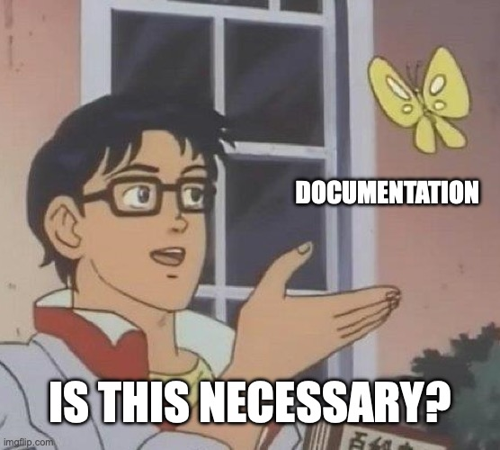

# DevOps CloudNativ Mini Projekt Documentation

</img>

## About the mini project :writing_hand:
Hello folks! I'm Fabio, the one and only. In this repository I'll provide my project and explain what it does and how I went by step by step.

## Why did I this? :computer:
The idea is to buy a dummy domain, host a t2.micro instance on AWS, and install and configure major packages [Here](packages.md) is a complete list of the packages. And be able to setup my own Unix mail server and login with a client to the mail account. I was looking anyway do to somithing like this for my own porposes. So I needed to write this ducomentation but now I'm force do to it beautiful.
</img>

## Progress of the project :bulb:
As mentioned, [here](documentation/doc.md) will be the whole step-by-step documentation of what happened and what I did to achieve the main goal. I decided to split every task to have a better view of what has changed on the t2.micro instance.